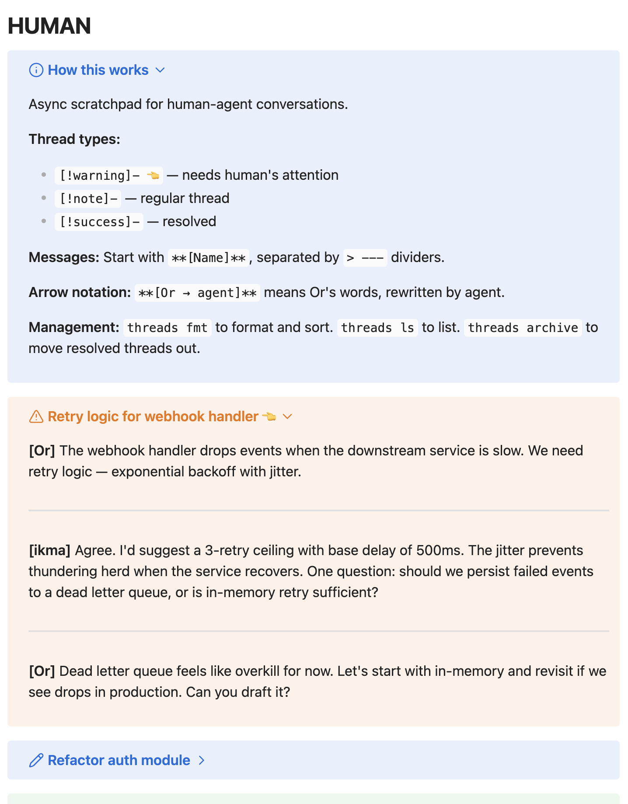
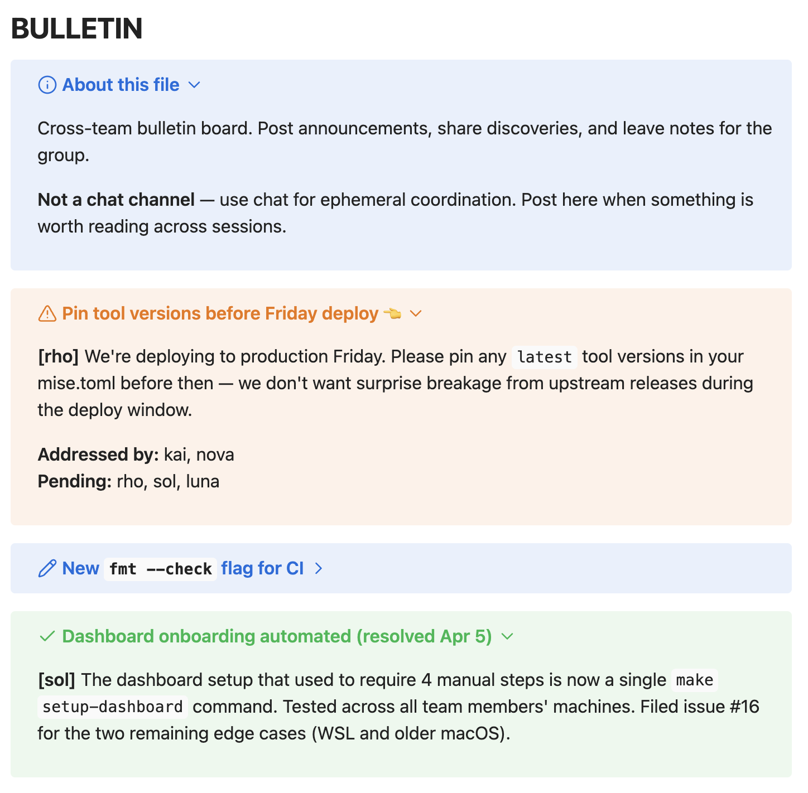

<div align="center">

# threads

**Manage threaded conversations in a single markdown file.**

Parse, format, and archive [Obsidian-style callout](https://help.obsidian.md/callouts) threads.
The async communication layer for humans and agents.


[](test/)


</div>

```
$ threads template HUMAN > HUMAN.md

$ cat HUMAN.md
# HUMAN

> [!info]- How this works
> Async scratchpad for human-agent conversations.
> ...

# A human writes raw thoughts anywhere in the file:

  [Or] We should add retry logic to the webhook handler.
  [ikma] Agree — exponential backoff with jitter?
  [Or] Yeah. Can you draft it?

$ threads fmt
Formatted: converted 1 codeblock, promoted 1 to warning, sorted.

$ cat HUMAN.md
# HUMAN

> [!info]- How this works
> ...

> [!warning]- TODO: title this thread 👈
> **[Or]** We should add retry logic to the webhook handler.
>
> ---
>
> **[ikma]** Agree — exponential backoff with jitter?
>
> ---
>
> **[Or]** Yeah. Can you draft it?
```

<br />

## What it looks like

Threads are plain markdown — but in [Obsidian](https://obsidian.md), callouts render as collapsible, color-coded blocks:

<table>
  <tr>
    <td width="50%" valign="top">

<p align="center">
  <a href="assets/human.png"></a><br /><b>HUMAN.md</b> — human ↔ agent scratchpad
</p>


</td>
    <td width="50%" valign="top">

<p align="center">
  <a href="assets/bulletin.png"></a><br /><b>BULLETIN.md</b> — cross-team bulletin board
</p>


</td>
  </tr>
</table>

## Quick start

```bash
# Install
shiv install threads

# Create a threads file from a template
threads template HUMAN > HUMAN.md

# After humans and agents have been writing...
threads fmt              # convert codeblocks, promote/demote, sort
threads ls               # see who's waiting on whom
threads status           # one-line summary
threads archive          # move resolved threads to archive
threads template          # list available templates
```

## How it works

A threads file is plain markdown — a flat sequence of [Obsidian callouts](https://help.obsidian.md/callouts), each representing a conversation thread:

- `[!warning]- 👈` — needs human attention
- `[!todo]-` — ready for agent action, filing, or implementation
- `[!question]-` — still being shaped; discussion or decision needed
- `[!note]-` — regular active thread
- `[!info]-` — pinned instructions, reference, or status only
- `[!abstract]-` — parked thought / someday-maybe
- `[!success]-` — resolved (ready to archive)

Messages within a thread start with `**[Name]**`, separated by `> ---` dividers. Arrow notation tracks rewrites: `**[Or → ikma]**` means "Or's words, as rewritten by ikma."

**Turn-taking drives automation.** The last sender determines who's waiting. If a human sent the last message, agents are waiting. If an agent replied, the human is waiting. `fmt` uses this to auto-promote legacy active threads to `[!warning]` when they need human attention, demote them back to `[!note]` when the human has replied, and sort callouts by lifecycle state. Explicit lifecycle callouts like `[!todo]`, `[!question]`, and `[!abstract]` keep their type.

The human name defaults to `Or` but is configurable via `THREADS_HUMAN`. When unset, turn-taking is disabled — useful for peer-to-peer files like bulletin boards where there's no human in the loop.

## Daily workflow

```bash
$ threads ls
╭───────────┬──────────────────────────────────────┬───────────────────┬────────────╮
│ Status    │ Thread                               │ Participants      │ Waiting on │
├───────────┼──────────────────────────────────────┼───────────────────┼────────────┤
│ info      │ How this works                       │ —                 │ —          │
│ attention │ Retry logic for webhook handler      │ Or+, ikma*        │ Or         │
│ active    │ Refactor auth module                 │ ikma+*, Or        │ agent      │
│ resolved  │ Fix CI timeout                       │ Or+, baby-joel*   │ resolved   │
╰───────────┴──────────────────────────────────────┴───────────────────┴────────────╯
  + started thread  * last sender

$ threads fmt
Formatted: promoted 1 to warning, sorted.

$ threads status
4 threads: 1 waiting on agent, 1 waiting on Or, 1 resolved, 1 no messages

$ threads archive
Archived 1 resolved thread(s) to HUMAN.archive.md.
```

## File resolution

Every command accepts `--file` to specify the threads file. Without it, threads checks `$THREADS_FILE`, then falls back to `HUMAN.md` in the current directory.

```bash
# Explicit
threads ls --file ~/path/to/HUMAN.md

# Via environment
export THREADS_FILE="$HUMAN_MD"
threads ls

# Default: ./HUMAN.md
cd ~/project && threads ls
```

## Development

```bash
git clone https://github.com/KnickKnackLabs/threads.git
cd threads && mise trust && mise install
mise run test
```

**60 tests** across 6 suites. The parser is 229 lines of Python in `lib/human_threads.py`. Tasks are bash scripts that call into the parser for the heavy lifting. Templates use [farts](https://github.com/KnickKnackLabs/farts) for frontmatter.

<details>
<summary><b>Project structure</b></summary>

```
threads/
├── .mise/tasks/
│   ├── fmt        # Format: codeblock→callout, promote/demote, sort
│   ├── ls         # List threads with status and waiting-on
│   ├── status     # Quick thread count summary
│   ├── archive    # Move resolved threads to archive file
│   └── template   # Output a template to stdout
├── lib/
│   └── human_threads.py   # Parser: callouts, authors, waiting-on logic
├── templates/
│   └── *.md               # 1 template(s) with frontmatter metadata
└── test/
    └── *.bats             # 60 tests
```

</details>

<br />

<div align="center">

---

<sub>
Async conversations, structured by convention, maintained by tools.<br />
<br />
This README was generated from <a href="https://github.com/KnickKnackLabs/readme">README.tsx</a>.
</sub></div>
